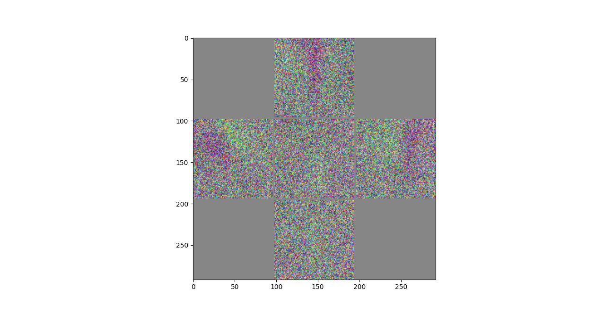
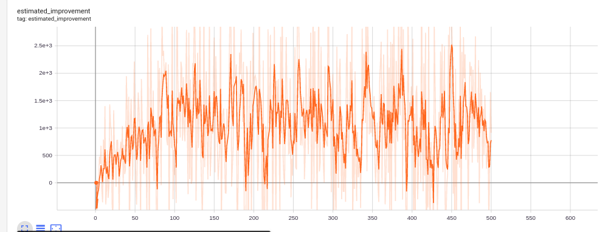
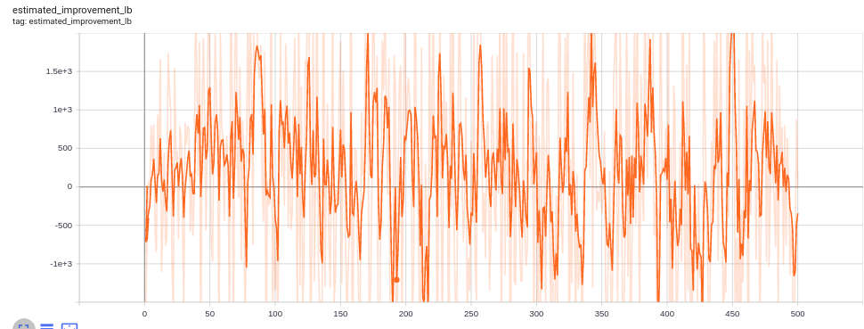
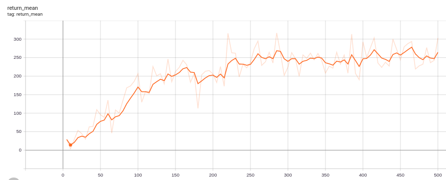

# TEK5040 -
# Deep learning for autonomous systems

markuhei - Markus Sverdvik Heiervang  

***

## Assignment 2 - Proximal Policy Optimization

## Linear vs Non-linear policy

Assume that the state of the policy is just the last observation $o_t$  
(as has been the case for this exercise).  

* Do you expect a linear policy to work?

Yes. I think a linear policy would work and be substantial for generating tracks.
Image templates would be easy to generate for gassing and turning

* Do you expect the optimal policy to be linear?  
* If not, what are some things you expect that the linear policy will have have issues with?

No. The car can go so fast that you have to slow down before you can even see a sharp turn.
Also, the optimal function for braking is clearly non linear with respect to turns.
Turns can go both ways, but not at the same time meaning that the function for break would be like a `left_turn XOR right_turn`

* If the camera view did not follow the position and direction of the car, but rather was a fixed view over the entire course, do you believe a linear policy would have worked better or worse?

I think it would perform worse.
Not only would it then be a huge challenge that the tracks are randomly generated,
it would also be a problem that the policy network has to keep track of where the car is at all times.

With a camera following the car, we only have to care about what the road ahead looks like.

That being said, i think a non-linear policy would perform better in such a case.  

* Can you think about a simple change to the environment that would make a linear policy not work at all?

Yes. If the camera was constantly rotating, if would be impossible for a linear policy to drive the car.
A non-linear policy might still be able to recognize this pattern.  

## Linear value network

The value network only needs to care about the cars position on the track and the difference between the earlier state, which can easily be done with template matching. Say, if we got negative rewards for going in the opposite direction that the one we start with, it would have to be non-linear, but that is not the case in this particular environment
So yes, i expect the value function to be linear in this case.  

## Convolutional vs fully connected model

Convolution neural networks are in general known to handle image data
better than fully connected neural netowrks and there are two main reasons for that.
The cnn's locality provides a regularization effect, which in turn makes the model
less prone to overfitting. A convolutional layer is also usually computationally cheaper than a dense layer.
Therefore, i believe that using a cnn is more appropriate for this task.

## Visualzation of weights

From what it looks like, it will be more likely to gas if the road is right in front of the car,
and turn in the direction corresponding to the road ahead.  
If the weights were perfectly trained for this task, I think the filter for turning left would precisely
be the inverse of the filter for turning left.
When it comes to braking and simply going forward, the distribution seems fairly random,
and i think that has to do with the limitations of linear policies

## Eval policy

N=1
min, max : (80, 267.938)
median, mean : (165.255, 167.759)

The car is able to drive and turn but it brakes way too much and goes fairly slow.
It is not able to recover when driving out of bounds.  

N=2
min, max : (107.517, 260.576)
median, mean : (180.752, 179.812)

This one is more nimble and elegant.

The car is better and quicker than when N=1

N=4
min, max : (87.8067, 299.066)
median, mean : (187.463, 185.597)

The car seems even faster, but not so careful

N=8
min, max : (66.6873, 229.071)
median, mean : (131.644, 135.675)

The car does not manage to turn and break at the correct time, and drives out of bounds almost instantly.

I think an action repeat of 4 gave the best results according to my measurements

## Actual improvement vs "predicted"

The expected returns seem to correlate to the estimated improvements,
so they seem to be correct to a certain extent, however the estimated improvements are very unstable, so it is hard to say.
