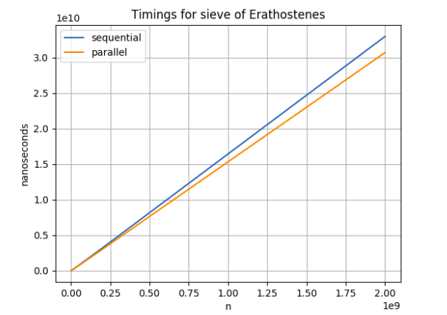
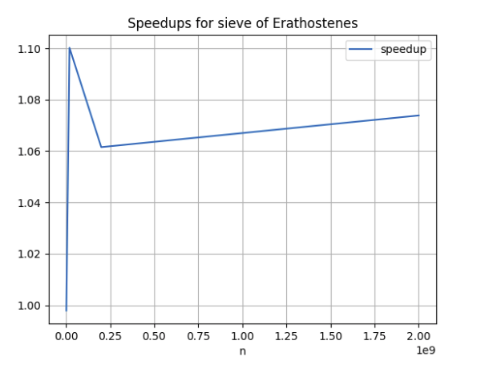
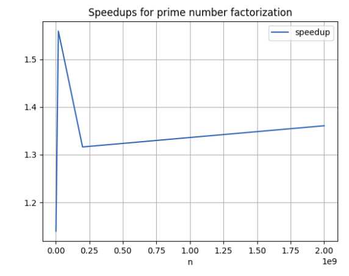
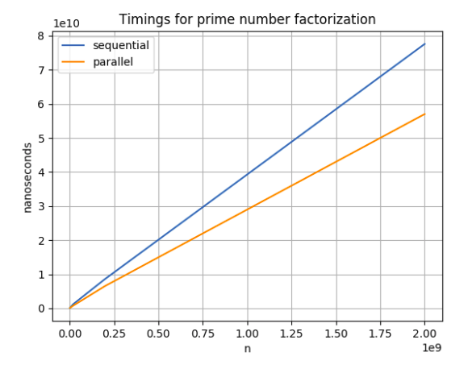
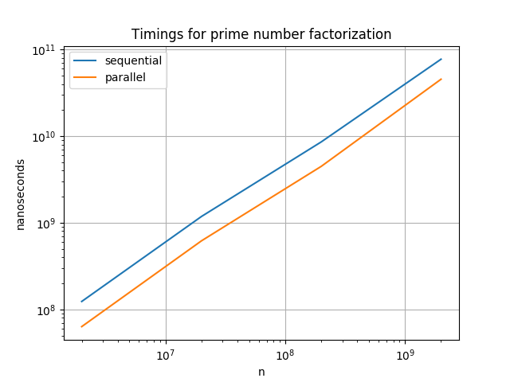
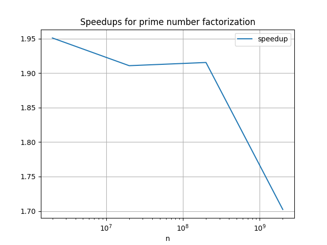

# Oblig 3 Attempt 2
### Markus S. Heiervang - markuhei
***

## Introduction

In this assignment, I do my best to achieve speedups by parallelizing the sieve of erathosenes and prime number factorization for relatively large numbers.  

#### Note:
Every change done in attempt 2 will be below the paragraph "Attempt 2"
Everything up until then is the same as in attempt 1

## User guide

All tests and benchmarks are ran in Main.java
The program takes two arguments: N and k where:  
N is the input size for the sieves and the prime factorization  
k is the number of threads to be used. If zero, k will be sat to the cpu's number of threads.  
Supply the `-skipTiming` flag to skip the part where the times of the sieves and factorizations are measured

## Parallel Sieve of Eratosthenes
the class is located in ParallelSieve.java
For the parallelization of the sieve I have tried to parallelize the process of marking the composite numbers in the table.  

First, I sequentially find all prime numbers until $\sqrt{N}$  
then I divide the entire table into k partitions from $\sqrt{N}$ to N  
then each thread gets their partition and start marking the different bits until all composites are checked.  

## Parallel factorization of a large number

### Sequential variant
The sequential variant did the following:  
take a number n
for each prime p in the array of primes generated by the sieve:  
  while n is divisible with p:
  $n \leftarrow \frac{n}{p}$, add p to the set of factors

then I did that for every number from $n^2 - 101$ to $n^2 - 1$  

Note that this might not be the most clever and efficient algorithm for doing this,
but it was the best one I was able to come up with.

### Parallel variant  
for the parallel variant I used a threadpool to remove some of the thread-initializing overhead.
I divided the tasks for each prime factorization as following:
  give each thread a starting offset from 0, to k  
  let each thread traverse the array of primes generated by the sieve with a step size of k  
  each thread checks if n is divisible by their current prime number p, and if it is,
  they put p in a collection of factors.  
  after all the threads are finished, the main thread conducts the sequential variant from the collection of prime factors, to check for multiples

## Implementation

First, the program tests the correctness between the sequential and the parallel sieve  
Then it measures the median duration of the sieves and the prime factorization on 7 runs. This might take very long, so i made it possible to run the program with the flag: "skipTiming" to skip this part.  

Lastly, the program outputs the prime factors through Oblig3Precode.java

## Measurements

Hardware information:  
* Intel Core i5-4210u CPU @ 1.70GHz  
* 2 cores, 4 threads  

after running the procedures 7 times the medians were:

|  n   |Seq sieve|Para sieve|Seq primeFac|Para primeFac|
|:----:|---------|----------|:----------:|------------:|
| 2m   | 326ms| 327ms | 1237ms | 1086ms |
| 20m  | 2725ms | 2476ms | 11945ms | 7660ms |
| 200m | 3s | 2s | 8s | 6s |
| 2b   | 32s | 30s | 77s | 57s |

    

  

  

  

The speedups are very slight, but still present.  
I am happy I got some speedup at all, considering the tasks were difficult to parallelize.

## Conclusion

I have been struggling a lot with this task, and with trying to get any good results.  I believe there are better ways to parallelize the problems, but with the time i had, these were the best results i could get.

# Attempt 2

## The sieve

The sieve was not very good from the first attempt. I spent a *lot* of time trying
to improve the speedups, and spent much time refactoring.

#### Strategy 1 Give each thread a local sieve and divide the prime numbers evenly:
With this strategy, I got around 1.2 speedup at best, which is pretty bad.
Another downside is that it copies the table for each threads, so it uses $p$ times
as much space as well.

#### Strategy 2
For this strategy, I tried to something that was suggested in one of the lectures:
find all primes up to $\sqrt{\sqrt{N}}$ with hi and lo variables for each thread
to modify their part of the sieve. Not only was this very time consuming to implent and difficult to achieve,
but I still got about the same result.

#### Conclusion
Parallelizing the sieve was a total failure. I did everything i could to achieve some significant speedup,
but in the end i just had to bounce back to my original variant.
I did not get any feedback or guidance regarding this sieve so I hope that is taken into consideration.

### Prime number factorization

#### Note
I have refactored the prime factorizers so that instead of directly writing to
the Oblig3Precode object, they return arrays of linkedlists containing the factors.
Each index in this array corresponds to the index in the array of numbers from
$N^2-101$ to $N^2-1$

#### Strategy 1:

On my 4 cores i still only got a speedup of 1.3. The strategy was to distribute a collection of prime factors
to each thread, and then find local factors for all number. The problem with this was that the threads didnt
know when all the primes of a number was found, so the time spent on merging the collections of all the factors
got a bit too high.

#### Strategy 2:

This is the best speedup i have gotten so far. The only problem is that there is
a constant amount of numbers to factorize, and i divided the array of numbers on the amount of threads.
I came up with a solution that gives better speedup on my 4 cores.
First i create all threads with an offset each, and then iterate over all the primes
starting with their offset and with a step size of the number of threads.
I used a cyclicbarrier to manage the rotation. If the amount of prime numbers to factorize
was parameterized, this method could have been useful with a lot of cores, but since this number
is fixed to 100 in this task, it might not efficiently utilize all cores.

#### Measurements  

|  n   |Seq primeFac|Para primeFac|
|:----:|:----------:|------------:|
| 2m   | 1237ms | 6331ms |
| 20m  | 11945ms | 6192ms |
| 200m | 8.5s | 4.5s |
| 2b   | 77s | 45s |

  

in this plot, both the y and x axis are logarithmically scaled 

  

in this plot, the x axis is logarithmically scaled

#### Conclusion

Refactoring the prime number factorization gave me way better results, with a speedup close to 2, a success.

## Appendix

see the Factors .txt files submitted in the delivery
