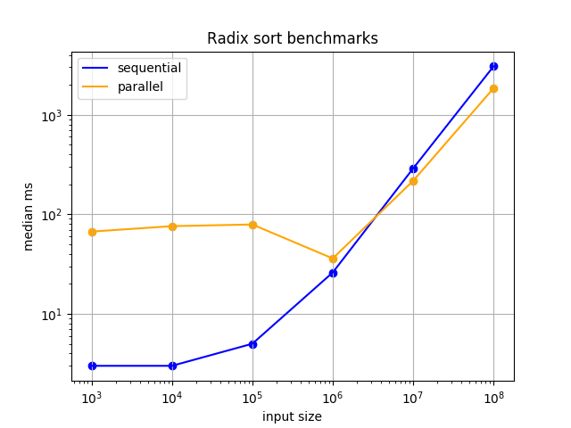

# IN3030 Oblig 4
### Markus S. Heiervang - markuhei
***

## Introduction

In this assignment, the task is to implement a parallel version of radix sort from
the sequential version in the precode.
The task is to achieve speedups greater than 1

## User guide

ParallelRadixSort takes 2 required arguments and 1 optional
n : size of array,
seed : seed for generating the random arrays
t : the amount of threads to be used, or, if higher than number of threads, the divisor of the tasks. If this argument is not supplied, the number will be sat to the number of processors availiable to the jvm. On high ns, t should be sat to a high numbers to optimize performance

Run example:  
```console
java ParallelRadixSort 10000000 0 16
```

As can be seen, I have used the sequential version (Oblig4.java) as a template for the implementation of ParallelRadixSort

For measuring, use Speedups.java

```console
Speedup: program to measure ParallelRadixSort and Oblig4
n=[integer] | the input size of the two algorithms. Defaults to 10000000
seed=[integer] | the seed for the randomly generated arrays
t=[integer] | the number of threads to be used. Defaults to Runtime.getRuntime().availableProcessors()
-f, --full | bencmarks runtimes with inputs 1000, 10000, ..., 100000000
-v, --verify | verifies that the arrays are sorted as described in the obligtext
-tf, --toFile | writes the measurements to the file speedups.txt
-q, --quiet | runs the program without printing to the console

```
run examples:  
```console
java Speedup --toFile --full t=32
```

```console
java Speedup n=200000 seed=7 t=10
```

### How to build  

It is as simple as just compiling everything with javac:  
`javac *.javac

## Parallel Radix Sort

The algorithm had 4 parts that had to be parallelized:  
part a: find the highest number in the array
part b: count occurences of digits
part c: create digit pointers
part d: transfer from array a to array b, utilizing the digit pointer array  

Parallelizing part a is just parallel arraymax, so I divided the array evenly for the
theads and let each thread find their local max.
Then, thread 0 sequentially found the max of all the local maxes.  

For parallelizing part b, I followed Arne Maus' algorithm as described in the document.

For part c, I had to think a little differently as I had to make the arraypointers
usable for the k threads. Of course, I didn't want to synchronize the pointerarray
in part d as it would be way too time consuming. In order to achieve speedup, it is not
nessecary to actualy parallelize this part since we are working with such small arrays,
but, whatever, I'll do what the task tells me to. So we're creating pointerarrays for each thread.
The pointer matrix is evenly divided column wise to the threads. Unfortunately, this
means the threads further to the left have to do more work.

For the final part, we divide the array a evenly among the threads, and each thread have
their respective pointerarray for this partition. Elements are moved from a to b accordingly, and
as all digits are unique, we can be certain that no thread is mutating the same cell in any of the arrays.

## Implementation

In my implementation I have been making use of a ~~fixed~~ cached threadpool, and a cyclic barrier
in order to reduce as much threading-overhead as possible. For every parallel task, I
supply a runnable as a lambda expression, as this is in my opinion more readable and simpler to implement.
As you will see in the measurements section, the results are not great,
and I am not certain as to what causes the time sink.

I've tried profiling the code by measuring time elapsed for each thread, and found out that  
for both part c and d, the workload is not always evenly distributed, which might be something
that slows down my program.  

I have modified the sort methods to be public instead of private, so that I
can use them in Speedup.java . Of course I have not modified anything in the file
Oblig4Precode.java .  

## Performance analysis

The CPU I have been running the program on is:  
Intel Core i5-4210u @ 1.7 GHz. 2 cores, 4 threads (with hyperthreading)

Initially I engineered this program with the idea of getting the maximum performance with 4 threads. After writing the program as it is, the best speedup
I got laid around 1.3. BUT when I tried it out with a higher number of threads,
I got way better performance. Of course, the overhead for the lower ns got higher. The best results I have gotten so far on n=100000000 are with t=64, so
the measurements below will be with t=64. When the number of threads are higher,
the batch sizes for all the tasks get lower, and when using the threadpool, we have some producer-consumer model. When minimizing the batch sizes and increasing the number of batches, we solve the problem of uneven distribution of workload, so I believe that is why I get the performance increase on t>numberOfCores.

After making this discovery, I changed the threadpool from a fixed threadpool
to a cached threadpool and achieved slightly better results for large n. I think
this is better because it is clearly always a better choice to set the parameter
t higher than the number of threads, though we should not have to use such a large
threadpool.

## Measurements


  


## Conclusion

The parallel variant yields the correct results.
The speedups are not great, but they are higher than 1 for sufficiently large n. Considering my computer only has 2 cores, the speedups should be sufficient. Obviously, the parallel version is only really useful for large ns.
I think I have learned a lot doing this assignment, especially about handling uneven distribution of workload. I have also gotten better at making use of the
cyclic barrier.
