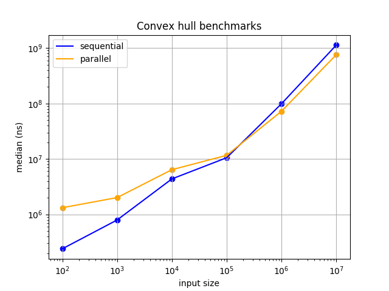

# IN3030 Oblig 5
### Markus S. Heiervang - markuhei
***

## Introduction

In this assignment, I implement a parallel version of the convex hull algorithm,
and try to achieve speedups greater than 1 on sufficiently large inputs

## User guide

Use Main.java to draw the convex hull and write the results to file.

```console
Main: program to test the sequential and parallel convex hull algorithm
n=[integer] | the input size of the two algorithms. Defaults to 100
seed=[integer] | the seed for the randomly generated points
--seq | run the sequential solution, draw the results if n < 1000 and write the results to file
--para | run parallel solution, draw the results if n < 1000 and write the results to file
--testAlignment | produces testcase that checks whether the hull algorithm includes points aligned with the hull
```

Run example for sequential solution:
```console
java Main --seq n=100 seed=123
```
Parallel:
```console
java Main --para n=100 seed=123
```

For running the algorithm, measuring, validating, etc. use Speedup.java

```console
Speedup: program to measure the sequential and parallel convex hull algorithm
n=[integer] | the input size of the two algorithms. Defaults to 100
seed=[integer] | the seed for the randomly generated arrays

-f, --full | bencmarks runtimes with inputs 100, 10000, ..., 10000000
-v, --verify | verifies that the algorithms give equal results
-tf, --toFile | writes the measurements to the file speedups.txt
-q, --quiet | runs the program without printing to the console
```

run examples:  
```console
java Speedup --toFile --full --verify
```

```console
java Speedup n=100000 seed=1234 -v
```

### How to build  

It is as simple as just compiling everything with javac:  
`javac *.javac`

## Sequential Convex Hull  

I started off with the sample solution from the courses github.
I generalized the two methods by creating a class for finding the farthest points and the points above a line, and storing them as instance variables.
Seeing that this could easily be parallelized in the parallel solution, I changed
it a tiny bit so that it extended the RecursiveAction class.

## Parallel Convex Hull

Since this is a recursive divide and conquer algorithm, I figured java's
ForkJoinPool would fit perfectly for this task. The algorithm creates a tree of
tasks that can be done in parallel, and merges the partial results together.
In that way, my implementation reminds a bit of merge sort.


### Implementation

There might be some inconsistent indentations in the source code as I shifted
my default indentation size from 2 to 4. Sorry about that.

The parallel solution utilizes java's fork-join framework, and uses a ForkJoinPool
 to complete the recursive task in parallel.

I added an equals method to the Intlist class, so that it is easier to
verify equal results between the two algorithms


## Measurements


  


## Performance analysis

The CPU I have been running the program on is:  
Intel Core i5-4210u @ 1.7 GHz. 2 cores, 4 threads (with hyperthreading)  
RAM: 8GB (I've been running the program with 6GB reserved)  


With 1.75 speedup at best, my solution performs pretty decent on my machine with 2 cores.
It is possible that i could've achieved greater speedups by controlling the batch sizes
after measuring a performance breakpoint between a sequential and a parallel solution.
Even with a median of 7 runs, the speedups do seem to oscillate between benchmarks,
usually staying around 1.6, so the performance increase is not completely stable.
I have also found out that the speedups seem to be greater when the program is given more memory.

The ForkJoinPool allows for task stealing in the sense that if one thread finishes it's tasks
before the rest, it can steal queued tasks from the other threads.

## Conclusion

I am happy I got to learn a new model for parallelism when working with a
tree-recursive task like this.
The results were decent, but the parallel algorithm is only efficient when $n > 10^5$
