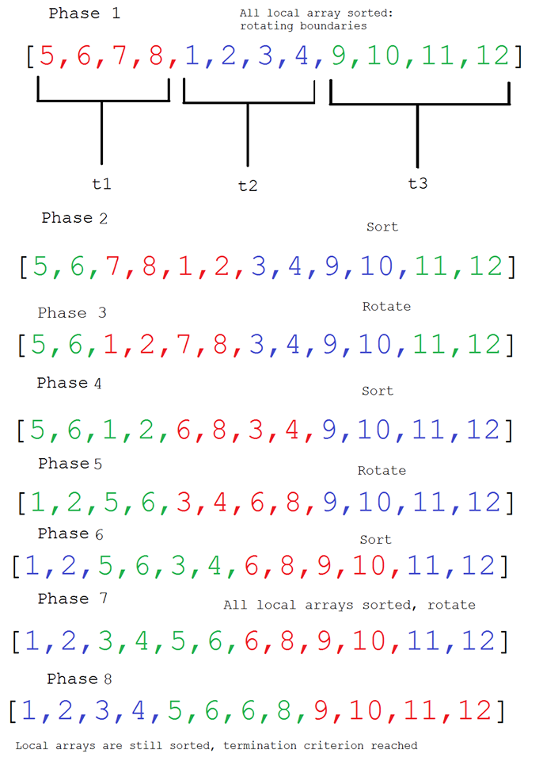

# Final exam IN3030  
Candidate ID: 15633  

***

## 1 - Java and Synchronization  

### 1.1 - Java threads and startup  

> In a Java program, there is one main thread that is automatically started when a program starts: it executes the main method of the program. This method can start other threads. Can those thread also start other threads? Provide a short explanation.

Absolutely. Regular threads started by the main thread have the same permissions as the main thread in terms of starting new threads.  


### 1.2 - Java threads execution on Multicore  

> Explain briefly how 100 Java threads can appear to execute concurrently asif the CPU had 128 cores – despite it having only 4 cores.

When you are creating 100 java threads, you are simultaneously creating 100 tasks, and with a cpu of 4 cores,
it can work on the tasks 4 at a time. However, if any of the threads become idle, the cpu can work on another thread
until the first thread has finished waiting. The threads do execute concurrently, however they do not all work in parallel. It is important to note that concurrency is not the same as parallelism.    

### 1.3 Java Synchronized  

> There are alternatives to using the Java keyword synchronized including many very specialized ways of synchronizaton. Pick your favorite alternatve to synchronized and explain why you prefer it and how it can replace synchronized. Your preference can be based on any type of argument: be it performance, usability, convenience, or a specialized use. The most important part of your answer will be your presentaton of the advantages and disadvantages in connecton with any specifc applicaton of your choice.

I think the ReentrantLock is the best synchronization utility to specifically replace use of the synchronized keyword.
The ReentrantLock can be applied to all applications of the synchronized keyword, but supports more features like conditions,
locks with timeouts, trylock  which is none blocking. All in all, the reentrantlock has a vast interface of methods that gives you all the nessecary information about the lock or the threads using it, that the object locks with synchronized blocks lacked.  
A synchronized method locks the entire object that the method is called from, which ensures great performance limitations,
but when using a reentrantlock, it is only the lock itself that gets locked. That means other threads can still call other methods that arent dependent on synchronization. The reentrantlock also supports an optional fairness policy, which ensures that the thread that has waited the longest gets the lock first. Finally, a reentrantlock, unlike a regular object within a synchronized block, does not require a block structure, which means that the lock can be locked and unlocked within different methods, which is very convenient in some cases.  

## 2 - Join using semaphores  

### 2.1 Join replacement   

> You are to achieve the effect of Java’s join, but instead of using join, you should use semaphores as in the Java class Semaphore.The idea is to modify the JoinP Java program given below to NOT use join, but instead use semaphores. Your task is now to write a version of JoinP where you have the join with some Java code that makes the program work like the original JoinP program without using join but instead using semaphores.Provide the resulting program along with a short explanation of your solution.

```java
import java.util.concurrent.*;
class JoinP {

    static Semaphore sem;

    public static void main(String[] args) {
        int numberofthreads = 10;
        sem = new Semaphore(-numberofthreads+1);
        Thread[] t = new Thread[numberofthreads];

        for (int j = 0; j < numberofthreads; j++) {
            (t[j] = new Thread( new ExThread() )).start();
        }

        try {
            sem.acquire();
        } catch (InterruptedException e) {
            e.printStackTrace();
        }

    }

    static class ExThread implements Runnable {
        public void run() {
            try {
                TimeUnit.SECONDS.sleep(10);
            } catch (Exception e) {
                return;
            } finally {
                sem.release();
            }
        }
    }
}
```

If the semaphore has fewer than 1 permit, calling sem.acquire() would cause the current thread to wait
until some other thread increments the permits by calling sem.release().
Since we initiate the semaphore with -numberofthreads + 1 permits (or in this specific case, -9)
when all threads have finished executing, there will be exactly one permit for the main thread to acquire.  


### 2.2 Test Case  

> You are to write a Java program that demonstrates a test case for the program that you wrote in 2.1.Explain the test that you chose and why you think it shows that your program from 2.1 works – at least for your chosen test case (it does not – at all – have to be comprehensive – just show a typical case). Each thread could, for illustration, print what it does at each step – be sure to include an id of the thread doing the printing.
Hint: You can “schedule” when threads actively try to do stuff by delaying them using, e.g.,TimeUnit.SECONDS.sleep(10);
Provide the program and its output and any comments that you might have.


```Java
import java.util.concurrent.Semaphore;
class TestJoinP {
    public static void main(String[] args) {
        TestJoinP to = new TestJoinP();
        to.assertSemaphoreUpdate();
    }

    public void assertSemaphoreUpdate() {
        JoinP.sem = new Semaphore(0);
        // Run the runnable sequentially
        new JoinP.ExThread().run();
        int permits = JoinP.sem.availablePermits();
        System.out.print("TEST assertSemaphoreUpdate ");
        if (permits == 1) {
            System.out.println("PASSED");
        } else {
            System.out.println("FAILED");
            System.out.println("Reason: number of semaphore permits should be 1, was"
             + permits);
        }
    }
}
```

Output:
`TEST assertSemaphoreUpdate PASSED`

This is a unit test that ensures that the threads actually release a permit when they terminate,
as it is essential for the program to terminate.  

It is pretty difficult to test the entire program since there is no actual work being done when the threads are sleeping.
There is also no guarantee that the the program finishes in 10 seconds, so writing a test timing it wouldn't be sufficient.  

## 3 - Double bubblesort  

> Bubblesort is a sorting algorithm that sorts, e.g., an integer array A, by repeatedly going thru the array from one end to the other comparing neighboring elements to each other – and swapping them when they are not in order. Double-bubblesort is a variant of bubblesort that works by comparing not two elements at a time but rather three elements at a time and swapping them so that they are in order.

### 3.1 - Sequential Double-bubblesort
> Write a sequential version of double-bubblesort in Java.Provide the Java program as your answer.

```java
public class DoubleBubbleSort {

    public void sort(int[] arr) {
        boolean isSorted = false;
        while (!isSorted) {
            isSorted = true;
            for (int i=0; i<arr.length-1; i += 2) {
                int swap;
                if (arr[i] > arr[i+1]) {
                    isSorted = false;
                    if (arr[i+1] > arr[i+2]) {
                        swap = arr[i];
                        arr[i] = arr[i+2];
                        arr[i+2] = swap;
                    } else {
                        swap = arr[i];
                        arr[i] = arr[i+1];
                        if (swap > arr[i+2]) {
                            arr[i+1] = arr[i+2];
                            arr[i+2] = swap;
                        } else {
                            arr[i+1] = swap;
                        }
                    }
                } else if (arr[i+1] > arr[i+2]) {
                    isSorted = false;
                    if (arr[i] < arr[i+2]) {
                        swap = arr[i+1];
                        arr[i+1] = arr[i+2];
                        arr[i+2] = swap;
                    } else {
                        swap = arr[i];
                        arr[i] = arr[i+2];
                        arr[i+2] = arr[i+1];
                        arr[i+1] = swap;
                    }
                }
                if (i+2 > arr.length-3 && i+2 < arr.length-1) i = arr.length-5;
            }
        }
    }
}
```

### 3.2 - Testing Double-bubblesort

> Write a simple Java test program showing that your program from 3.1 can sort an array of 10 elements containing the numbers from 1 to 10 in reverse order. Print suitable test output from the program. Provide the program and its output.

```Java
import java.util.Arrays;
class TestDoubleBubbleSort {
    public static void main(String[] args) {
        int[] arr = new int[]{10, 9, 8, 7, 6, 5, 4, 3, 2, 1};

        DoubleBubbleSort sorter = new DoubleBubbleSort();
        System.out.println("Input array: " + Arrays.toString(arr));
        System.out.println("Sorting...");
        sorter.sort(arr);
        System.out.println("Output array: " + Arrays.toString(arr));
    }
}
```

Program output:  
```console
Input array: [10, 9, 8, 7, 6, 5, 4, 3, 2, 1]
Sorting...
Output array: [1, 2, 3, 4, 5, 6, 7, 8, 9, 10]
```

### 3.3 - Parallelizing Double-bubblesort

>How can your program from 3.1 be parallelized? Describe the design of a solution that MUST be loyal to the algorithm, i.e., splitting the array into k parts that are double-bubblesorted individually then merge sorted, is not loyal as much of the speedup is gained by using merging, which is much more efficient for large arrays than any bubblesort. Hint: spend time on describing the parallelization as this is central to the course.

To parallelize the double-bubblesort algorithm, we can divide the array into k parts in place,
so that each thread work with array between two boundaries at a time: one upper boundary and one lower boundary.
Then we can shift those boundaries by some number, say $partitionSize/2$ (where partitionSize is the size of each the k partitions of the array), indices after each iteration, so that we prevent it from terminating with an only locally sorted array. Termination criterion is verifying that all the local arrays are sorted twice. After we have seen that all the local arrays are sorted, we shift the boundaries once again and verify that the **entire** array is sorted. A cyclic barrier will be an excellent utility for this, as each phase is dependent on all threads having finished. Due to the fact that some threads will have to do more work than other, we can give each threads multiple boundaries to sort and allow for task stealing. The k variable should be measured and determined empirically.   

Here's an illustration of how the array could be sorted assuming all local arrays are sorted in phase 0:

{height=400, width=400}

We have to take special care when the boundaries goes from the end to the start of the array, since there is an exception in how the elements are compared there.  

### 4.1 - The Speed of Light in Vacuum

> What is the exact speed of light in vacuum? Give your answer in m/s and make sure it is exact.

Speed of light = $299 792 458 m/s$

### 4.2 Latency

> In 1988, the latency for a so-called ping request, that is the time to send a packet over the internet from one point, A, to another point B, and a reply making its way from B to A, was about 200 ms for a ping request from Scandinavia to the US West Coast – approximately 10,000 km. In 2020, the ping time is about 180 ms. Explain why the time is almost the same after 32 years---despite great improvements in transatlantic bandwidth.  

To put it simply, increasing the ping drastically, though possible, is so inefficient and expensive in resources that
we would do better with having 180ms pings from any regular home computer in Scandinavia to us west coast.
We could technically install a fiber optic cable all the way scandinavia to us west and get a faster connection, but
the cable has to be both inconveniently long and inconveniently expensive, so no one would want to do that. With direct light in vacuum from Scandinavia to west coast us, it would take about 60ms which is faster than 180ms but it gets exponentially harder to approach that latency. It needs to be considered that the ping signal doesn't travel in a straight line, but rather through different points, like nodes as in a graph, typically in a zig-zag pattern.   
