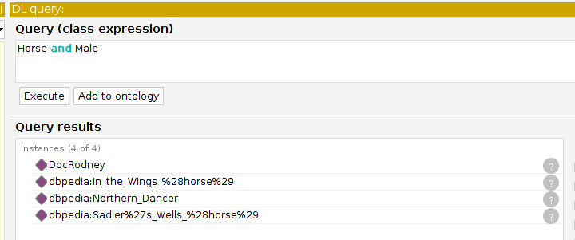

# IN3060 - Oblig 6
### Markus Sverdvik Heiervang - markuhei
***

## 1.1 DL Axioms  

3. Horse $\sqsubseteq$ Animal
4. Animal $\sqsubseteq$ Male $\sqcup$ Female
5. Male $\sqcap$ Female $\sqsubseteq \bot$  
13. MonteHorse $\sqsubseteq$ RaceHorse $\sqcup$ hasCompeted some HorseRace
14. SuperHorse $\sqsubseteq$ RaceHorse $\sqcup$ hasWon min 101 HorseRace
15. hasWon $\sqsubseteq$ hasCompeted
19. RaceHorse $\sqsubseteq$ hasTrainer some Person
21. $\langle h, t \rangle \in$ hasTrainer $\rightarrow \langle h, t \rangle \in$ trains  

## 1.2 Questions

1. Unknown. RexRodney is not a member of any class which is a subclass of Male
2. Yes. Kjell Håkonsen trains Rex Rodney and Rex Rodney won Elitloppet 1986.
It is entailed by the rule we made in the first execrise, quoting:
"Every trainer had interest in a race if a horse he/she trains competed in this race"  
3. Unknown. Whether the horse is coldblooded or warmblooded is not asserted, and the only way we could know
without these assertions would require us to know the age of the horse, which we don't
4. Unknown. Same reason as above
5. Unknown. Same reason as above
6. No. ReadySteadyGo is a MonteHorse which means she has only competed in monteraces.
Elitloppet is not a MonteRace.

## 2 Connecting to dbpedia

I had to download the racehorse file to get it to work, so i added it in the delivery as an appendix

### Decisions and interpretation  

As dbpedia:Stallion is a dbp:sex, it is clear that dbpedia:Stallion and the class Stallion
are two different things. I interpreted dbpedia:Stallion as the value of the property
dbp:sex for any male horse

## 2.1 Questions
Individuals with sex: stallion  
  
Individuals of class: stallion  
  

In the wings' grandfather is a blank node with the name "Northern Dancer" and there
is no way to know for sure that there are no other horses with the same name.
