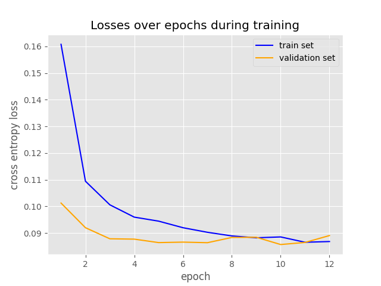
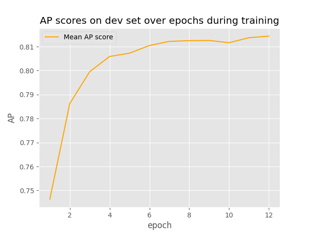
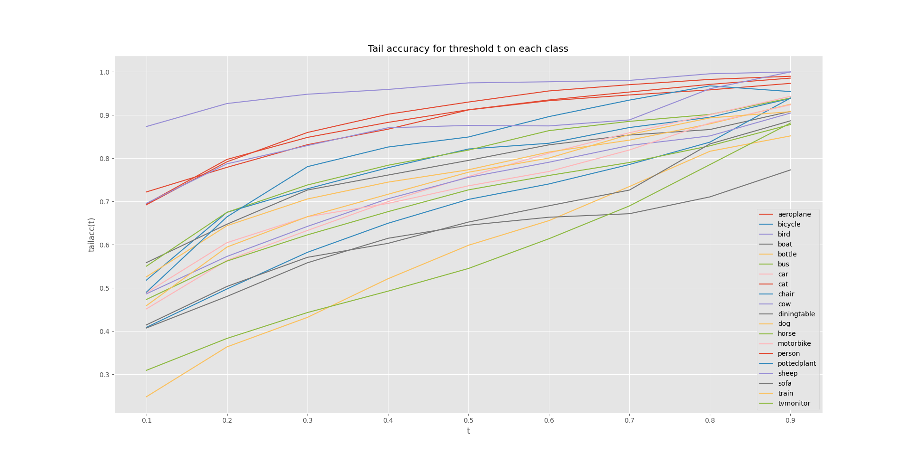
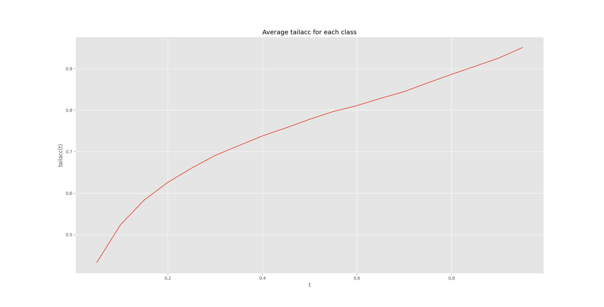
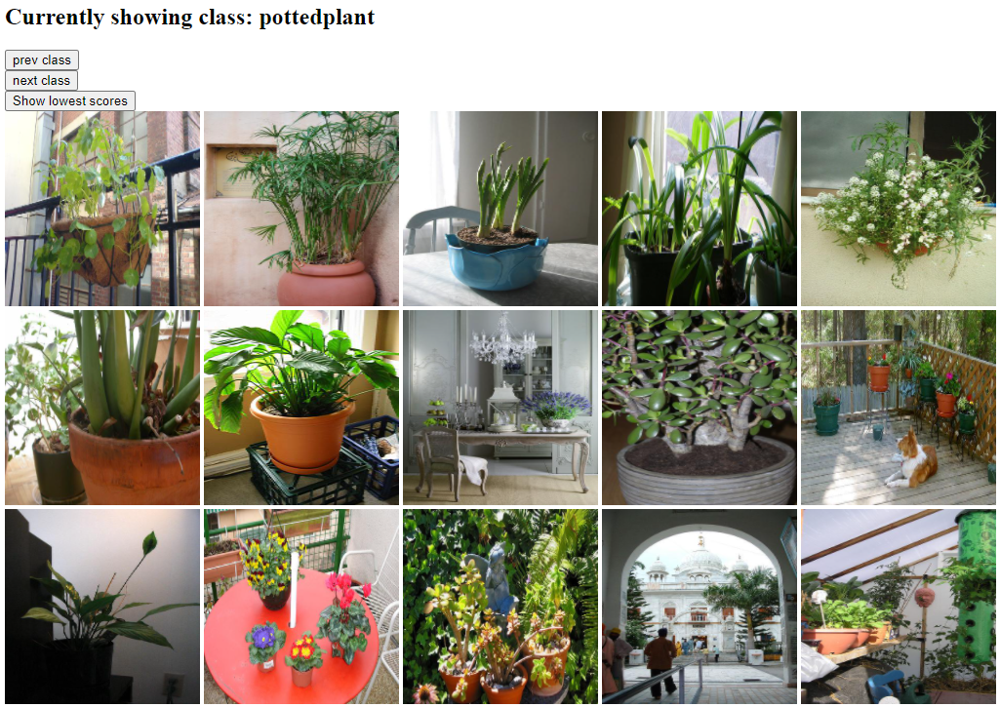
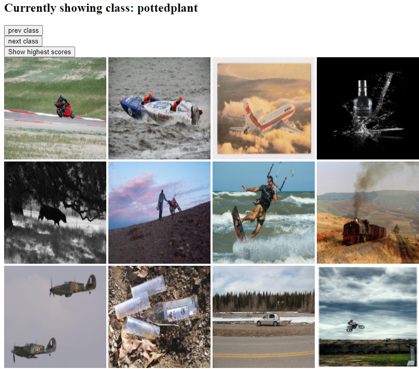

# IN5400 - Assignment 1  
Markus Sverdvik Heiervang - markuhei  

***  

The most common classification tasks we see in machine learning are tasks where the classes are
mutually exclusive. However when classifying images, it is common to see images that are members of
multiple classes (for instance, an image that contains both a person and a motorcycle).
The Pascal Visual Object Class dataset is a multi-class multi-label dataset that addresses this issue.
In this work we show that using transfer learning on ResNet18 pre-trained on a mutually exclusive multi-class dataset,
we are able to use reuse the parameters to achieve good results on the PascalVOC dataset.
Furthermore, we experiment with modifying the ResNet model to utilize batch normalization.  


### Contents:  

1. Fine-tuning a pretrained model

2. Modifying the architecture of ResNet18  

3. How to run GUI  


# 1 - Fine-tuning a pretrained model  

```
* Results were documented using the config: `configs/adam_model.json`  
* Train script can be found in `src/scripts/train.py`  
```
We are presented with the Pascal Visual Object Class 2012 dataset,
which is a multi-label classification dataset. This entails that we need a
classifier capable of predicting multiple labels for each training instance.
The dataset has a pre-defined train, dev and test set which we will use for training,
model selection and the final testing.  


The model we will use is a pre-trained resnet18. This is a discriminative classifier, originally trained
on a thousand classes. We will apply transfer learning and fine-tune the resnet18
model to predict our 20 classes from our dataset.  

To go from a 1000 class classifier, to a 20 class multi-label classifier, we have to
make a small change to the model architecture. The final layer of resnet18 is
originally a linear layer with 512 inputs and 1000 outputs. We replace this layer
with a layer that can map these 512-dimensional representations to 20 classes.
Furthermore, we add sigmoid activations at the end of the model to get an independent,
probabilistic estimation for each class.  

Our loss function has to be redefined. We cannot use regular softmax cross-entropy loss,
since our classes are mutually inclusive. Instead, we use binary cross-entropy loss
which will tune the probabilities independently for each class. Contrary to the assignment text,
writing a custom loss function is not at all necessary.
Our own loss function, we can simply use pytorch's `BCELoss` as long as we use sigmoid as the output activation function.  
$$\sigma (x) = \frac{1}{1-e^{-x}}$$  

An argument for using this function as part of the output layer is that it directly outputs a probability estimate of each class, with each class getting a probability between 0 and 1 independently. Optionally, the model can be trained without a sigmoid function at the end, meaning
it will output raw logits. In such a case, we use pytorch's `BCEWithLogitsLoss`. However, we will insert the sigmoid function directly into the model.  

The classifier (and the train script) we trained on the dataset had the follow hyperparameters:  

* Random seed: 42  
* Optimizer: Adam  
* Learning rate: 1e-3  
* Resnet parameters: frozen  
* Epochs: 11  
* Batch size: 16  

For validation, we use the metric Average Precision (AP), as it is most appropriate
for multi-label classification. The resulting classifier got a mean AP of approximately 0.82.
Using the Adam optimizer, it converged relatively quickly, as it already reached a mAP of 0.74 after a single epoch.  
Both training and validation losses were also drastically reduced after the first epoch. The plots below are the metrics starting from epoch 1.  

{ height=500 width=500 }   

{ height=500 width=500 }   


Since we have probability outputs ranging between 0 and 1, we need to decide a threshold t, which is the highest
value of a probability such that it becomes a positive classification. This is usually set at 0.5, but can be adjusted based on
a precision / recall trade off. The tail accuracy is a function of t, estimating how well the model performs given the threshold:  

$$ \text{Tailacc}(t) = \frac{1}{\sum_{i=1}^n \mathbb{I} [f(x_i) > t]} \sum_{i=1}^{n} \mathbb{I}[f(x_i) = y_i]\mathbb{I}[f(x_i) > t], t > 0$$

when measuring the tail-accuracy, we get the following results:  

{ height=500 width=500 }   

{ height=500 width=500 }   

With the GUI application we are able to inspect the 50 most and least probable images for the given class.  

{ height=500 width=500 }

We can see that the model correctly classifies the images on which it is confident   

{ height=500 width=500 }   

It is hard to say why exactly these images are the ones the model is most confident on not containing a potted plant, but it
is at least right in the fact that there are no potted plants in these images.   

# 2 - Modifying the architecture of ResNet18  

In this task, we replace all the convolutional layers in the model with
a weight-normalizing version of the 2-dimensional convolutional layer.  

The implementation of this lies in the `modified_resnet.py` script.
The class `WeightStandarizedConv2d` is equivalent to `vsconv2`, but was renamed
in order to follow the `PEP8` standard, and for descriptiveness. The class
`WeightStandardizedResNet18` constructs a `resnet18` model as base model, and
replaces the layers with standardized convolutional layers by recursively
iterating over the submodules.  

```
I was not able to alter the batch normalization,
which might have affected my results.
I used parameters equal to the adam model from task 1 and
ran it both with frozen parameters
and adjustable parameters. In either case, the loss flattened out on 0.2 and
the mean AP also remained on the same level.  
```

The function for training is the main function of `train.py`  

# How to run GUI  

The gui is browser based, using flask  

(This has been tested on an ubuntu 20.04 platform)  

Install the required packages. If you get dependency issues it might be a good idea to set up a virtual environment.  
`pip3 install -r requirements.txt`  

Run app.py in the src folder  
`python3 src/app.py --file_path [path_to_voc]/VOC2012/JPEGImages/`  
or simply with the make file  
`make gui root_dir=[path_to_voc]/VOC2012/JPEGImages/`  

*Note that the brackets indicate the path which you must fill in, as the path is most likely
different on your computer  

Go to localhost:5000 in your browser, and the GUI should appear  
