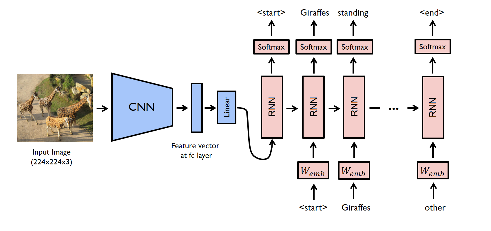

# Image Captioning using heterogenous CNN-RNN architecture  
Assignment 2, IN5400
Markus Sverdvik Heiervang - markuhei@ifi.uio.no

***   

### Abstract  

Deep learning has revolutionized computer vision (CV) and natural language processing (NLP).
They are usually considered to be two fairly different topics, yet some tasks
requires an intersection of NLP and CV methods. Image captioning is as such,
both an NLP and a CV task, and requires neural architectures/inductive biases
from both fields to achieve these results. In this work, we train an
image-captioning model which combines pretrained convolutional neural networks (CNNs)
with recurrent neural networks (RNNs), to generate image descriptions in a single sentence.  

Keywords: CV, NLP, Image Captioning, Deep Learning, CNN, RNN

***   


## Introduction  

Image captioning is a generative machine learning task which combines language modelling
with image classification. More important is the fact that improving image captioning systems
can immensely benefit people who are blind, or visually impaired and require assisting tools for universal design.  

[@DBLP:journals/corr/LinMBHPRDZ14] present an image captioning dataset, namely the COCO dataset, which is a `large-scale object detection, segmentation, and captioning dataset.`
and contains over 200.000 images with 5 different captions per image. For generative language modelling tasks such as this, summarization, question answering etc, it is common to have multiple target instances, as there are many phrasings of a correct predictions. For such tasks, metrics such as ROUGE and METEOR are used.   

## Model architecture  

The image captioning model is primarily composed of two components: the CNN and the RNN. The CNN is a pre-trained model which we can think of as a feature extractor. It transforms the input image into learned, latent representations that should hold information about what the image contains. The RNN component is to be trained for this task-specific dataset, and is abitrary in it's implementation. By that, we mean that the RNN can be a simple Elman RNN or a gated RNN such as a Long Short-Term Memory (LSTM) or a Gated Recurrent Unit (GRU). We will reproduce these three RNN variants from scratch in PyTorch. 



The image captioning model uses teacher forcing during training, which means that instead of language modelling using the last prediction as input, we force the target token as the next input in the input sequence. In inference, on the other hand, we generate the next token, using the last token until we get an end of sentence token or reach a limit. Because of this, the training and validation loss become somewhat less meaningful during training, as the true outputs are generated by the model alone.  

## Reproducing the RNN models  

#### The Elman RNN  

The Elman RNN, also known as the "simple rnn" is the first RNN variant, containing a single set of weights for the input and hidden state. In this implementation, we concatenate the hidden state with the input vector, and multiply with a shared input-hidden matrix.  

The hidden states are defined as such:  

$h_0 = \mathbb{0} \in \mathbb{R}^{n}$

$h_i = tanh(concatenate(x_i, h_{i-1})\times W + b)$

where
$x$ is an input vector,
$n$ is the hidden state size,
$W$ is the weight matrix for x and h,
$b$ is the bias vector for x and h,
$i$ is the current time step

The pytorch implementation is as follows:  

```python
class ElmanRNNCell(nn.Module):
    def __init__(self, input_size, hidden_size, activation_fn=torch.tanh):
        super(ElmanRNNCell, self).__init__()
        self.hidden_state_size = hidden_size

        parameter_size = input_size + hidden_size

        weight_init = torch.randn(parameter_size, hidden_size) / np.sqrt(parameter_size)


        self.weight = nn.Parameter(weight_init)

        self.bias = nn.Parameter(torch.zeros(1, hidden_size))
        self.activation = activation_fn

    def forward(self, batch, h=None):
        device = self.weight.device
        output_tensor = torch.empty(
            len(batch), 
            self.hidden_state_size, 
            dtype=batch.dtype
        ).to(device)

        if h is None:
            h = torch.zeros(self.hidden_state_size).to(device)

        for i, x in enumerate(batch):
            inputs = torch.cat((x, h)).to(self.weight.device)
            h = self.activation(inputs @ self.weight + self.bias).squeeze()
            output_tensor[i] = h

        # In the elman rnn, the hidden representations and
        # outputs are the same
        return output_tensor
```
We use the term "cell" here to refer to a single layer of rnn.  

#### The LSTM  

The Long Short Term Memory (LSTM) is one of the two most common gated RNNs and was proposed by [@HochSchm97]. This model uses `forget gates`, `input gates` and `output gates` as well as an additional memory vector. Below is the pytorch implementation:  

```python
class LSTMCell(nn.Module):
    def __init__(self, input_size, hidden_size):
        super(LSTMCell, self).__init__()

        self.concat_size = hidden_size+input_size
        
        self.hidden_state_size = hidden_size
        self.input_size = input_size

        self.weight_f = self.init_weights()
        self.bias_f = self.init_bias()

        self.weight_i = self.init_weights()
        self.bias_i = self.init_bias()

        self.weight_meminput = self.init_weights()
        self.bias_meminput = self.init_bias()

        self.weight_o = self.init_weights()
        self.bias_o = self.init_bias()


    def forward(self, batch, h=None):
        device = self.weight_f.device
 
        output_tensor = torch.empty(len(batch), self.hidden_state_size).to(device)

        c = torch.zeros(self.hidden_state_size).to(device)

        if h is None:
            h = torch.zeros(self.hidden_state_size).to(device)


        for i, x in enumerate(batch):
            x_h = torch.cat((x, h))
            # linears
            f_state = torch.sigmoid(x_h @ self.weight_f + self.bias_f).squeeze()
            i_state = torch.sigmoid(x_h @ self.weight_i + self.bias_i).squeeze()
            c_canidate = torch.tanh(x_h @ self.weight_meminput + self.bias_meminput).squeeze()
            o_state = torch.sigmoid(x_h @ self.weight_o + self.bias_o).squeeze()
    
            # memory
            c *= f_state
            c += i_state * c_canidate

            h = o_state * torch.tanh(c)

            output_tensor[i] = h

        return output_tensor

    def init_weights(self):
        w = torch.randn(self.concat_size, self.hidden_state_size)
        return nn.Parameter(w * w.var())

    def init_bias(self):
        return nn.Parameter(torch.zeros(1, self.hidden_state_size))
```


#### The GRU  

The Gated Recurrent Unit is another RNN introduced in by [@DBLP:journals/corr/ChoMGBSB14] . We implement our own variants in pytorch. Implementation:   

```python
class GRUCell(nn.Module):
    def __init__(self, input_size, hidden_size):
        super(GRUCell, self).__init__()

        self.concat_size = hidden_size+input_size
        
        self.hidden_state_size = hidden_size
        self.input_size = input_size

        self.weight_u = self.init_weights()
        self.bias_u = self.init_bias()

        self.weight_r = self.init_weights()
        self.bias_r = self.init_bias()

        self.weight = self.init_weights()
        self.bias = self.init_bias()


    def forward(self, batch, h=None):
        device = self.weight.device
 
        output_tensor = torch.empty(len(batch), self.hidden_state_size).to(device)

        if h is None:
            h = torch.zeros(self.hidden_state_size).to(device)
        
        for i, x in enumerate(batch):
            xh = torch.cat((x, h))
            xh_r = torch.sigmoid(xh @ self.weight_r + self.bias_r).squeeze()
            
            xh2 = torch.cat((x, (xh_r * h)))

            h_tilde = torch.tanh(xh2 @ self.weight + self.bias)

            xh_u = torch.sigmoid(xh @ self.weight_u + self.bias_u)

            hu = h * xh_u

            h = hu + (1-xh_u) * h_tilde
            h = h.squeeze()
            output_tensor[i] = h
        return output_tensor

    def init_weights(self):
        w = torch.randn(self.concat_size, self.hidden_state_size)
        return nn.Parameter(w * w.var())

    def init_bias(self):
        return nn.Parameter(torch.zeros(1, self.hidden_state_size))
```


## Training the models  

*Note: due to limited time, and the custom rnn classes being unoptimized, we had to use the rnn implementations from the pytorch as they are highly optimized, and make training go much faster.  

During the training phase, we can qualitatively inspect the development of the image captioning model. It becomes quite apparent that after the first epoch, the most common and obvious pattern in the dataset becomes that all sentences start with "A" as in "A man with a straw hat". 

The second most obvious pattern in the dataset that the model picks up on early is "A man", 
as a large amount of the captions start with "A man". One can notice that it learns once it starts predicting words that are vaguely related to the captions, such as "a bathroom with" vs "a living room with a brown couch" 

Using the same learning rates, the RNN model seems to learn quicker than the GRU and LSTM at the beginning. The faster convergence of the Elman RNN is likely because it has fewer parameters to optimize for. It is likely that it plateus quicker because it has more limitations thatn the gated rnns.  

We used the following parameters for training:
- random seed: 42
- optimizer: AdamW (Adam with weight decay)
    - weight decay: 1e-5
- learning rate: 1e-3
- embedding size: 300
- hidden state size: 512
- batch size: 128  

## Evaluation

After training the models for 50 epochs, we get the following results:  

|Model|METEOR|ROUGE|BLEU-4|CIDER|
|-|-|-|-|-|
|RNN|0.23|0.5|0.17|0.62|
|GRU|0.23|0.5|0.18|0.62|
|LSTM|0.23|0.5|0.17|0.61|

All the rnn variants experimented are single layered.  


## Conclusion  

Using pre-computed CNN representations, we were mostly able to extract sufficient information
to caption the images. We got satisfactory METEOR scores, and showed that our image captioning system is capable of providing somewhat useful captions.     


# References

