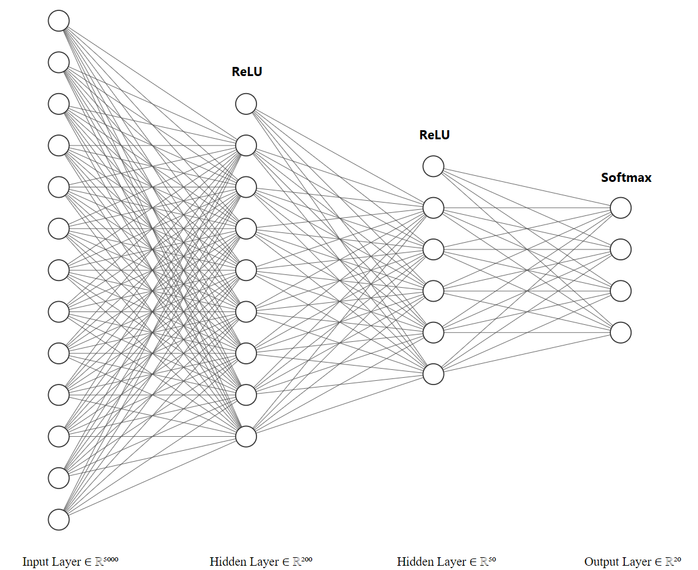
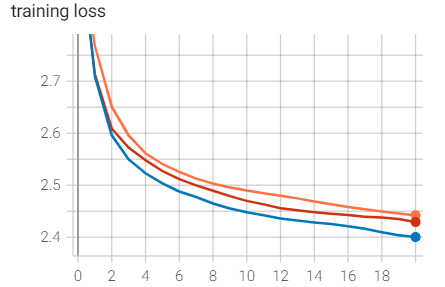
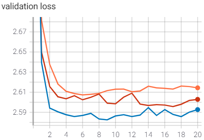
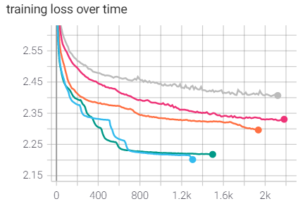
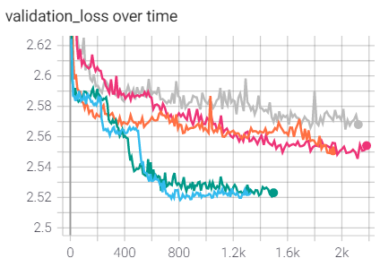
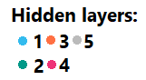

# Neural bag of words classifier

#### IN5550 - Assignment 1

Markus S. Heiervang, Sondre Wold

To reproduce this experiment, please see the code at [github.uio.no](github.uio.no/markuhei/IN5550), and follow the instructions given by the `README.md` file.  
It is a private repository but if you are an IN5550 instructor, you should have been granted access.  

Libraries used are the following:  

`numpy, pandas, sklearn, pytorch, tensorflow`  

---

#### Abstract  

In this work, we implement and benchmark different dense neural network architectures on a 20-class natural language dataset using varying bag of words representations. We measure effects of different hyperparameters to estimate the nonlinear separability of the feature representations as well as finding an optimal classifier for the classification task. The dataset used is a subset of the signal dataset: a collection of news articles of 20 different sources which our classifiers will attempt to predict. We find that our best neural network is able to outperform logistic regression with a small margin.   

***  

### 1. Introduction  

Use of bag of words representaions is usually based on the assumption that use of words can sufficiently separate the classes, independently of order. We typically see this kind of vectorization used along with a linear model such as logistic regression or support vector machine. However, these linear models have some limitations. Linear models are for instance, not able to pick up mutual exclusion between dimensions of the input vectors in the decision function they approximate. This is simply because the xor function is not linearly separable. However, a multi layered perceptron with nonlinear activation functions can be able to pick up on such a pattern if present in the data.  

#### 1.2 Motivation  

To consider whether this argument of nonlinearity actually holds, we need to estimate these benefits empirically. Furthermore we will measure the effects of how an increased number of neural network parameters will improve on its ability to discriminate between the 20 classes we are presented with. Selecting vectorizer parameters is also a non-trivial task that requires experimentation.  

### 2. Data Processing  

The data we are presented with is already to some extent preprocessed. Stop words are absent, while the terms present are both lemmatized and POS tagged.  

`data_utils.py` contains all the necessary utilites to manipulate the data the way we want. Running the program will split the dataset into `train` and `dev` subsets. For our experiments, we have decided to split the data 70-30.  

The method `load_signal_data` reads the content of the target dataset into a pandas dataframe object. For preprocessing, we use scikit-learn, as it provides a very good, fast, and ridiculously simple interface for vectorizing text data. For the text features, depending on the provided command line argument when running `train.py`, we vectorize our data with either sklearn's `CountVectorizer` or `TfidfVectorizer`. These transform our data into matrices with token counts, providing BoW representations for the dataset. For the labels, we use the sklearns `LabelEncoder` – turning each label into a numeric reference.

If one should select a large enough vocabulary, sparse matrix compression is necessary. Both scipy and Pytorch provide utilites for these, as well as our method `csr_to_float_tensor` which convers a scipy matrix into a pytorch sparse tensor. This is cofigurable in `train.py` by supplying the argument `--sparse_tensor`.  

It is important to note the class distributions for any dataset, as it will have implications for how we score our models. Below is an image showcasing the class distributions of our training set, resembling closely the distiributions in the overall dataset

{height=300px width=500px}  

### 2. Implementation of neural networks  

We set an initial neural network topology as following:  
`n_features x 200 -> relu -> 200 x 50 -> relu -> 50 x n_classes -> softmax`  

{ width=500px height=300px }  

In the illustration above, the features are fixed to 5000 words. Though we initially started with this number, we found that increasing the vocabulary to 6000 words improved our performance marginally.  
We use the ReLU function for nonlinear activations in the hidden layer as they are computationally
efficient, and do not struggle with a vanishing gradient. A Softmax function is used in the output layer to predict for a mutually exclusive, probability distribution over the classes. The implementation of the model can be found in `model.py` which contains the `DenseNeuralClassifier` we'll be using.     

For training, we pass the specified hyperparameters through the CLI. The script finds a model if it exists and either initiates, or resumes a training procedure for the given epochs.  

For preprocessing variation, we try out three variants of vectorization:  
1. `Count vectorization`   
2. `Binary vectorization`  
3. `Tf-idf vectorization`  

To benchmark the effects of the vectorizers we estimate the performance of our initial neural network architecture with training and validation loss over 20 epochs, learning rate 1e-3, vocabulary size 6000. The experiments are run with the seed 420, with a batch size of 128 using the Adam optimizer.  

{ height=150 width=150 }  
{ height=250 width=250 } { height=250 width=250 }  

The plots above shows the cross entropy loss over 20 epochs, using the different vectorizers. From the plot it is clear that binary vectorization outperforms both count vectorization and tf-idf vectorization.  

After landing on binary feature vectorization, we initiated hyperparameter tuning my measruing the effect of increasing and decreasing the number of hidden layers. Our experiments included measurements of the following topologies. The bredth of the layers were set to 200 except for the last one (set to 50) in any of the networks with hidden layers greater than 1.  
{ height=250 width=250 }
{ height=250 width=250 }  

{ height=100 width=100 }  

The plots clearly show that the models' convergence time scale with the number of parameters (and layers). All the models were trained on an equal number of epochs, but as we can see from the plots, they terminated at different times. The x axis of both the plots is time measured in seconds. We can see from the plots that the optimal model is the initial model architecture we proposed. We will use this model to run against the baseline.   

### 3. Evaluation

To estimate the benefit of the neural networks' non-linearities, we run the model against a linear baseline.
In our case, this will be a logistic regression classifier. The baseline model can be found in the file `baseline.py`. The table below shows the baseline estimator's performance. All numbers in the estimates below are rounded to closest second point decimal.   

| Baseline | precision |    recall |  f1-score |
| :--------------------------- | --------: | --------: | --------: |
| macro avg                    |    0.48 | 0.47 |   0.47 |
| micro avg                 |    0.54 | 0.55  |   0.54 |
| accuracy | | 0.55 | |

After running the selected model on 150 epochs, we get the following results when evaluating on the dev set:  

| Optimal Model | precision |    recall |  f1-score |  
| :--------------------------- | --------: | --------: | --------: |
| seed 420 | | | |
| macro avg | 0.48 | 0.47  |  0.47        |
| micro avg | 0.55  | 0.55  |  0.55        |
| accuracy | | 0.55 | |  
| seed 42 | | | |
| macro avg | 0.48 | 0.47  |   0.7 |
| weighted avg                 |    0.55 | 0.55  |   0.54       |
| accuracy | | 0.55 | |
| seed 1337 | | | |
| macro avg                    |    0.49 | 0.47 | 0.47         |
| weighted avg                 |    0.55 | 0.56   | 0.55         |
| accuracy | | 0.56 | |

| Mean | precision |    recall |  f1-score |  
| :--------------------------- | --------: | --------: | --------: |
| macro avg | 0.48|0.47|0.47|22543|
| micro avg | 0.55|0.55|0.55|22543|
| accuracy | | 0.553 | |  

| Standard deviation | precision |    recall |  f1-score |  
| :--------------------------- | --------: | --------: | --------: |
| macro avg | $4.7e^{-3}$ |0|0|
| micro avg | 0|$4.7e^{-3}$|$4.7e^{-3}$|  
| accuracy | | $4.7e^{-3}$ | |  

Our new best model outperforms the baseline classifier marginally, and we can conclude that our experiment has proven
some benefit to using hidden layers in our model.  

### 4. Conclusion  

Despite conducting extensive hyper-parameter optimization, we were only able
to outperform the linear baseline estimator marginally using a 2-hidden layer neural network. Though our findings indicate that a neural network can be better as such a classification task, only beating logistic regression by a small margin also gives an indication that using multiple layers is not immensely beneficial given the data and the representations.  
